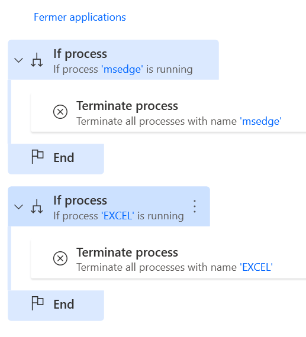
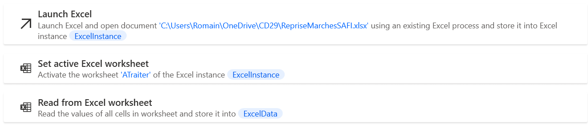
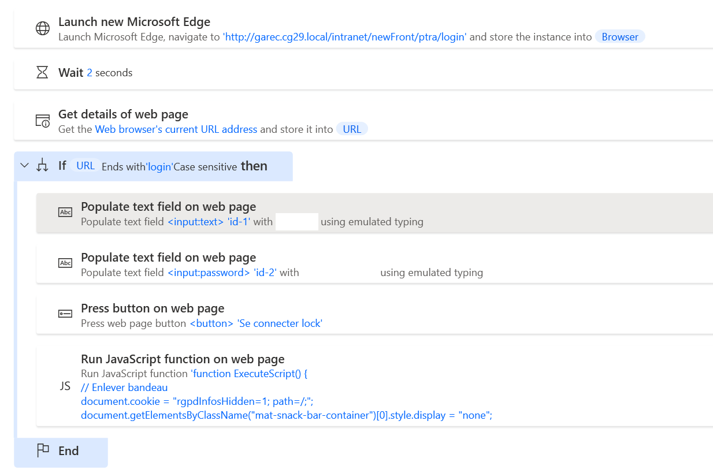

# Reprise des marchés SAFI - A_Initialisation


## Fermer les applications


## Lire les données dans le fichier Excel

Les données sont stockées dans ExcelData.
Pour y accéder, il faut ajouter des crochets : ExcelData[x][y]
Où "x" correspond à la ligne et "y" correspond à la colonne.

Le tableau comporte une ligne d'en-tête, donc la première ligne de données est la ligne numéro 2 sur Excel. Dans ExcelData, elle correspond à x=0.
x correspond donc au numéro de la ligne Excel moins 2.

Pour y, plutôt que de raisonner par lettres pour les colonnes. On peut utiliser directement le titre de la colonne entre apostrophes. Les colonnes peuvent ainsi être déplacées sans problèmes.

!!! Warning
    Penser à bien mettre à jour la colonne de fin lorsque de nouvelles colonnes sont ajoutées à l'étape de lecture des données du fichier Excel.


## Se connecter à Grand Angle

On allume Microsoft Edge sur la page de connexion.

Il peut arriver (surtout lors des tests) que l'on soit déjà connectés afin de poursuivre l'automatisation même dans un statut connecté, on vérifie l'URL.
Si on est sur la page de connexion, l'URL de la page se termine par "login" on remplit alors les informations de connexion.
Si on est redirigé automatiquement sur le tableau de bord, l'URL change et ne se termine plus par "login". Les étapes sont ignorées.

Lors de la connexion, un bandeau s'affiche pour accepter les cookies. Pour le masquer, on ajoute ce script :

### Enlever le bandeau
``` javascript
// Enlever bandeau
document.cookie = "rgpdInfosHidden=1; path=/;";
document.getElementsByClassName("mat-snack-bar-container")[0].style.display = "none";
```