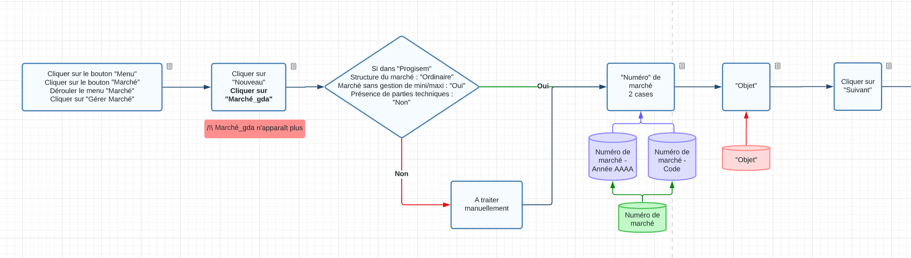
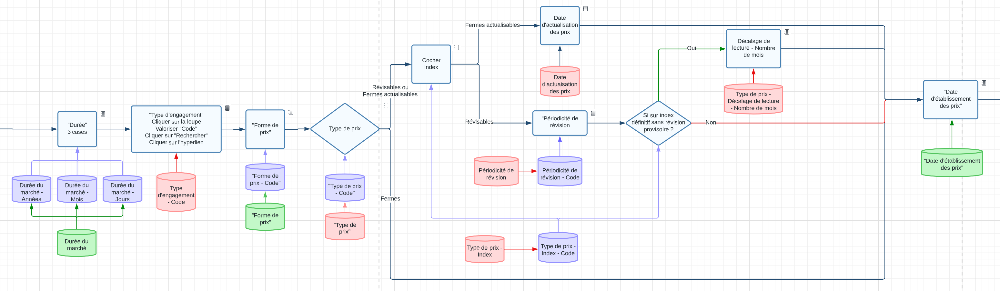
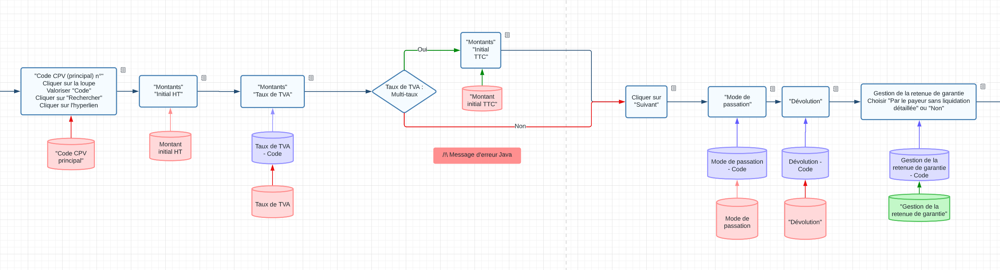
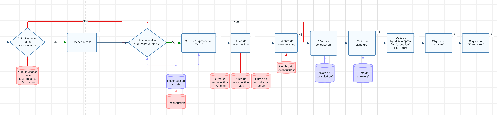

# Reprise des marchés SAFI - B_CreationNouveauMarche






## Cliquer sur créer un nouveau marché et remplir les premières informations

### Cliquer sur les éléments du menu

```javascript
//Cliquer sur les elements du menu
document.getElementsByClassName("bouton-menu")[0].click()
document.getElementsByClassName("mat-focus-indicator bandeau__button mat-button mat-button-base ng-star-inserted")[3].click()
document.getElementsByClassName('menu ng-star-inserted')[0].click()
document.getElementsByClassName('gda_bouton NouveauImg gda_bouton_actif')[0].click()
```

### Remplir la première page
```javascript
//Remplir les informations sur le marché
document.getElementsByName('marche_miAnnee')[0].value="%ExcelData[LoopIndex]['Numéro de marché - Année AAAA']%";
document.getElementsByName('marche_msNumero')[0].value="%ExcelData[LoopIndex]['Numéro de marché - Code']%";
document.getElementsByName('marche_msObjet')[0].value="%ExcelData[LoopIndex]['Objet']%";
```
### Cliquer sur Suivant

On lance le javascript associé au bouton Suivant.

```javascript
effectuerSuivante()
```
### Remplir la durée
```javascript
// Duree
document.getElementsByName('marcheDuree_miAnnees')[0].value="%ExcelData[LoopIndex]['Durée du marché - Années']%";
document.getElementsByName('marcheDuree_miMois')[0].value="%ExcelData[LoopIndex]['Durée du marché - Mois']%";
document.getElementsByName('marcheDuree_miJours')[0].value="%ExcelData[LoopIndex]['Durée du marché - Jours']%";
```

## Ajouter un type d'engagement

### Cliquer sur la loupe Type d'engagement

Plutôt que de cliquer sur la loupe directement, on lance le javascript associé.

```javascript
// Cliquer sur la loupe Type d'engagement
saisieAssisteeTypeEnga()
```

### Attacher la nouvelle fenêtre de navigateur


### Remplir la code à rechercher

```javascript
document.getElementsByName('typejCode')[0].value="%ExcelData[LoopIndex]['Type d\'engagement - Code']%";
```

### Cliquer sur le bouton Rechercher

On lance le script associé au bouton Rechercher
```javascript
rch_jsp_BoutonRechercher()
```

### CLiquer sur le premier élément de la liste
Ici, il n'y a pas de Name ou d'ID pour choisir l'élément à cliquer. On fait donc une recherche par TagName. Il s'agit du 5ème élément de la liste des "a" sur la page.
```javascript
document.getElementsByTagName('a')[4].click()
```
!!! note
    Pour déduire la recherche par TagName à utiliser. Dans l'inspecteur il faut regarder le type d'élément. Ici il s'agit d'un lien "a". On recherche ensuite par itération avec la console jusqu'à ce que notre élément soit sélectionné:
    ```javascript
      document.getElementsByTagName('a')[0]
      document.getElementsByTagName('a')[1]
      document.getElementsByTagName('a')[2]
      document.getElementsByTagName('a')[3]
      document.getElementsByTagName('a')[4]
    ```

## Remplir la forme, le type de prix et leur date d'établissement
### Forme de prix
Il s'agit d'un menu déroulant, mais on peut valoriser la valeur comme un champ de texte.
```javascript
// Forme de prix
document.getElementsByName('formePrix_miCode')[0].value="%ExcelData[LoopIndex]['Forme de prix - Code']%";
```

!!! note
    Pour simplifier l'automatisation, tous les choix possibles sont rassemblés dans la feuille "Listes" sur Excel avec la correspondance avec le code sur Grand Angle.
    Une colonne a ensuite été ajoutée sur la feuille principale en utilisant RECHERCHEV() qui affiche directement le code qui correspond à l'option à sélectionner.

### Type de prix

Il s'agit d'un bouton radio, mais on peut valoriser la valeur comme un champ de texte.
```javascript
// Type de prix
document.getElementsByName('typePrix_miCode')[0].value="%ExcelData[LoopIndex]['Type de prix - Code']%";
```

Après avoir sélectionné le type de prix, de nouvelles cases s'affichent si le type de prix n'est pas ferme.

#### Type de prix "Révisables" ou "Fermes actualisables"

On coche le type d'index
```javascript
// Cocher index
document.getElementById(%ExcelData[LoopIndex]['Type de prix - Index - Code']%).checked=true
```

##### Type de prix "Fermes actualisables"

On définit la date d'actualisation des prix
```javascript
// Date d'actualisatiom
document.getElementsByName('marche_mdtDatePrix')[0].value='%ExcelData[LoopIndex]['Date d\'actualisation des prix']%'
```

##### Type de prix "Révisables"

On définit la périodicité de révision
```javascript
// Periodicite de revision
document.getElementById('indexID').checked=true
```

###### Si "sur index définitif sans révision provisoire"

On renseigne le "décalage de lecture" qui correspond à un nombre de mois.
```javascript
// Nombre de mois
document.getElementById('indexID').checked=true
```

### Date d'établissement des prix

On renseigne ensuite la date d'établissement des prix.
```javascript
// Date d'etablissement des prix
document.getElementsByName('marche_mdtDatePrix')[0].value="%ExcelData[LoopIndex]['Date d\'établissement des prix']%";
```

## Choisir le Code CPV
### Cliquer sur la loupe

```javascript
// Code CPV principal
saisieAssisteeCodeCpv();
```

### Attacher le navigateur

http://garec.cg29.local/intranet/glob/sass/ChargerRechercherCodeCPVPopup.gda

### Récupérer premier résultat

```javascript
// Code CPV - Recuperer premier resultat
str = document.getElementsByTagName('a')[1].getAttribute('href').replaceAll('\t','').replaceAll('\n','').replace('javascript:','').replace('; return false;','');
setTimeout(str,1);
```

## Remplir les Montants

### Remplir Montant initial HT

```javascript
// Montant initial HT
document.getElementsByName('marche_mdInitHT')[0].value=%ExcelData[LoopIndex]['Montant initial HT']%;
document.getElementsByName('marche_mdInitHT')[0].onfocus();
```

### Remplir Taux de TVA

```javascript
// TVA
document.getElementsByName('marcheTva_MiCode')[0].value=%ExcelData[LoopIndex]['Taux de TVA - Code']%;
document.getElementsByName('marcheTva_MiCode')[0].onchange();
```

#### Si le taux de TVA est "multi-taux" : Remplir Montant initial TTC

```javascript
// Montant initial TTC
document.getElementsByName('marche_mdInitTTC')[0].value="%ExcelData[LoopIndex]['Montant initial TTC']%";
document.getElementsByName('marche_mdInitTTC')[0].onchange();
```

### Page suivante

```javascript
// Page suivante
effectuerSuivante()
```

!!! Warning
    Une erreur s'affiche. Malgré plusieurs tentatives, impossible de s'en débarasser.
    Elle n'est pas bloquante. Il suffit de cliquer une deuxième fois sur "Suivant"

```javascript
// Page suivante
effectuerSuivante()
```

## Remplir Mode de passation, dévolution et la gestion de la retenue de garantie

```javascript
// Mode de passation
document.getElementsByName('modePassation_miCode')[0].value="%ExcelData[LoopIndex]['Mode de passation - Code']%";
```

```javascript
// Devolution
document.getElementsByName('modeDevolution_miCode')[0].value="%ExcelData[LoopIndex]['Dévolution - Code']%";
```

```javascript
// Gestion de la retenue de garantie
document.getElementsByName('marche_retenue_garantie_miCode')[0].value="%ExcelData[LoopIndex]['Gestion de la retenue de garantie - Code']%";
```

## Définir l'auto-liquidation de la sous-traitance

Si Auto-liquidation de la sous-traitance est à "Oui", on coche la case.

```javascript
// Cocher auto-liquidation de la TVA
document.getElementsByName('marche_mbAutoLiqTvaSousTraitant')[0].checked=true
```

## Reconduction

```javascript
// Cocher Expresse ou Tacite
document.getElementsByName('%ExcelData[LoopIndex]['Reconduction - Code']%')[0].click()
```

```javascript
// Duree de reconduction
document.getElementsByName('marche_miAnneeReconduction')[0].value="%ExcelData[LoopIndex]['Durée de reconduction - Années']%";
document.getElementsByName('marche_miMoisReconduction')[0].value="%ExcelData[LoopIndex]['Durée de reconduction - Mois']%";
document.getElementsByName('marche_miJourReconduction')[0].value="%ExcelData[LoopIndex]['Durée de reconduction - Jours']%";
```

```javascript
// Nombre de reconduction
document.getElementsByName('marche_miNbReconduction')[0].value="%ExcelData[LoopIndex]['Nombre de reconductions']%";
```

## Définir les dates de consultation, de signature

```javascript
// Date de consultation
document.getElementsByName('marche_mdtConsultation')[0].value="%ExcelData[LoopIndex]['Date de consultation']%";
```

```javascript
// Date de signature
document.getElementsByName('marche_mdtSignature')[0].value="%ExcelData[LoopIndex]['Date de signature']%";
```

## Délai de liquidation et fin du flux

```javascript
// Delai de liquidation
document.getElementsByName('')[0].value="1460";
```

```javascript
// Page suivante
effectuerSuivante()
```

```javascript
Valider()
```