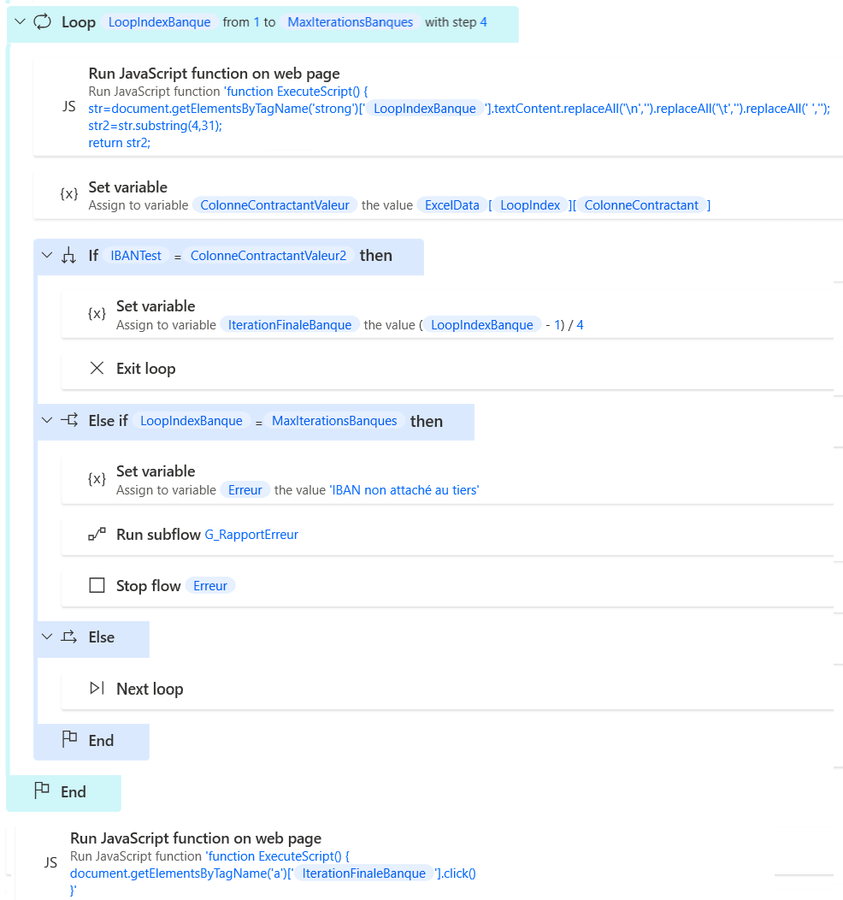

# Reprise des marchés SAFI - C_CreationContractant


```javascript
//Cliquer sur l'onglet détails
ChangerOnglet(2);
```
```javascript
// Créer un contractant
chargerPage('../../intranet/marc/CreerContractant.gda', event)
```

Etant donné qu'il y a le numéro du contractant variable dans le nom de colonne, par précaution, on assigne une nouvelle variable : "Colonne Contractant" qui contient le numéro dynamique du contractant :


```
Variable "Colonne Contractant"
Contractant %LoopIndexContractant% - Tiers - Code
```

```javascript
// Remplir le Code Tiers
document.getElementsByName('contractantTiers_miCode')[0].value="%ExcelData[LoopIndex][ColonneContractant]%";
```
```javascript
lancerAllerRetourRPCTiers(document.forms[0], 'contractantTiers_miCode', 'contractantTiers_msLib', 'contractantRefBancaire_miCode', 'contractantRefBancaire_msLib', 'contractantTiers_miCode', null, 'callbackRetourARTiers','contracantRefBancaireTiers_miCode','contracantRefBancaireTiers_msLibelle','provenance');
```


```
Variable "Colonne Contractant"
Contractant %LoopIndexContractant% - Rôle - Code
```

```javascript
// Remplir le rôle
document.getElementsByName('contractantRole_msIdentif')[0].value="%ExcelData[LoopIndex][ColonneContractant]%";
```

### Si rôle Mandataire


```javascript
Si le rôle est mandataire :
%ExcelData[LoopIndex][ColonneContractant]% = MA
```

```javascript
Contractant %LoopIndexContractant% - Mandataire - Désignation
```


## Tiers

```javascript
// Remplir Désignation
document.getElementsByName('contractantMsDesignationGroupementMandataire')[0].value="%ExcelData[LoopIndex][ColonneContractant]%";
```

### Références bancaires

```javascript
// Cliquer sur la loupe
saisieAssisteeReferenceBancaire('contractantTiers_miCode', 'contracantRefBancaireTiers_miCode', 'contractantRefBancaire_miCode', 'contractantRefBancaire_msLib');
```

Attacher le navigateur
http://garec.cg29.local/intranet/glob/sass/recherchePopupRefTiers.gda

Plusieurs références bancaires peuvent apparaître. Il faut choisir celle qui correspond et retourner un message d'erreur lorsque la référence bancaire n'est pas enregistrée.



On récupère le nombre total d'éléments en "gras".
Il y a 4 éléments en gras par ligne, on récupère le nombre d'éléments dans la liste des éléments en gras sur la fenêtre.
Le bouton à cliquer est le premier élément de la ligne sur un modulo 4.
Le dernier élément sélectionnable est donc le dernier élément moins 3.
On stocke cette valeur dans une variable "MaxIterations"


```javascript
// Obtenir le nombre de résultats
nb=document.getElementsByTagName('strong').length-3;
return nb;
```


Le résultat stocké n'est pas automatquement reconnu en nombre. On convertit donc "MaxIterations" en nombre "MaxIterationsBanque" pour permettre des itérations.

On change la "Colonne contractant" :
Contractant %LoopIndexContractant% - Iban à créditer

On lance ensuite une boucle de 0 à MaxItérationsBanques avec un pas à 4 (pour chaque ligne)

On récupère la valeur de l'IBAN et on supprime les espaces, tabulations et sauts de ligne. On supprime le texte au début et à la fin et on se retrouve avec l'IBAN seul.

```javascript
str=document.getElementsByTagName('strong')[%LoopIndexBanque%].textContent.replaceAll('\n','').replaceAll('\t','').replaceAll(' ','');
str2=str.substring(4,31);
return str2;
```

On a 


## Montants


Contractant %LoopIndexContractant% - Montant prévisionnel HT
