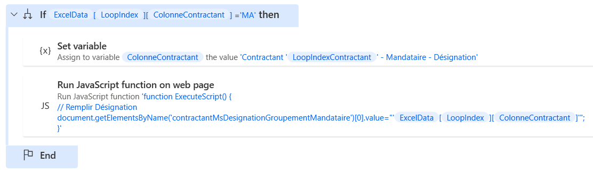

# Reprise des marchés SAFI - C_CreationContractant


## Cliquer sur les boutons
Cliquer sur l'onglet "Détails"
```javascript
//Cliquer sur l'onglet détails
ChangerOnglet(2);
```

Cliquer sur "Créer un contractant"
```javascript
// Créer un contractant
chargerPage('../../intranet/marc/CreerContractant.gda', event)
```

Etant donné qu'il y a le numéro du contractant variable dans le nom de colonne, par précaution, on assigne une nouvelle variable : "Colonne Contractant" qui contient le numéro dynamique du contractant :


```
Variable "Colonne Contractant"
Contractant %LoopIndexContractant% - Tiers - Code
```
## Identification du Contractant
### Remplir le Code Tiers
```javascript
// Remplir le Code Tiers
document.getElementsByName('contractantTiers_miCode')[0].value="%ExcelData[LoopIndex][ColonneContractant]%";
```
Après avoir saisi le code Tiers, il faut lancer les scripts qui se chargent habituellement lors du changement dans la case.
```javascript
lancerAllerRetourRPCTiers(document.forms[0], 'contractantTiers_miCode', 'contractantTiers_msLib', 'contractantRefBancaire_miCode', 'contractantRefBancaire_msLib', 'contractantTiers_miCode', null, 'callbackRetourARTiers','contracantRefBancaireTiers_miCode','contracantRefBancaireTiers_msLibelle','provenance');
```
### Remplir le rôle du Contractant
Le rôle peut être : Titulaire, Sous-traitant ou Mandataire

Définir la Colonne Contractant : Rôle du Tiers
```
Variable "Colonne Contractant"
Contractant %LoopIndexContractant% - Rôle - Code
```

La liste des rôles et leurs indexs respectifs sont renseignés dans Excel. Il suffit d'attribuer la valeur.
```javascript
// Remplir le rôle
document.getElementsByName('contractantRole_msIdentif')[0].value="%ExcelData[LoopIndex][ColonneContractant]%";
```

#### Si le rôle est Mandataire

Si le rôle est mandataire :
```javascript
%ExcelData[LoopIndex][ColonneContractant]% = MA
```

On sélectionne la ColonneContractant suivante :
```javascript
Contractant %LoopIndexContractant% - Mandataire - Désignation
```

On remplit ensuite la colonne "Désignation du mandataire"

```javascript
// Remplir Désignation
document.getElementsByName('contractantMsDesignationGroupementMandataire')[0].value="%ExcelData[LoopIndex][ColonneContractant]%";
```

### Références bancaires

#### Cliquer sur la loupe et attacher le navigateur

```javascript
// Cliquer sur la loupe
saisieAssisteeReferenceBancaire('contractantTiers_miCode', 'contracantRefBancaireTiers_miCode', 'contractantRefBancaire_miCode', 'contractantRefBancaire_msLib');
```

Attacher le navigateur
http://garec.cg29.local/intranet/glob/sass/recherchePopupRefTiers.gda

#### Choisir la bonne référence bancaire

Plusieurs références bancaires peuvent apparaître. Il faut choisir celle qui correspond et retourner un message d'erreur lorsque la référence bancaire n'est pas enregistrée.


On récupère le nombre total d'éléments en "gras".
Il y a 4 éléments en gras par ligne, on récupère le nombre d'éléments dans la liste des éléments en gras sur la fenêtre.
Le bouton à cliquer est le premier élément de la ligne sur un modulo 4.
Le dernier élément sélectionnable est donc le dernier élément moins 3.
On stocke cette valeur dans une variable "MaxIterations"


```javascript
// Obtenir le nombre de résultats
nb=document.getElementsByTagName('strong').length-3;
return nb;
```

Le résultat stocké n'est pas automatquement reconnu en nombre. On convertit donc "MaxIterations" en nombre "MaxIterationsBanque" pour permettre des itérations.

On change la "Colonne contractant" :
Contractant %LoopIndexContractant% - Iban à créditer

On lance ensuite une boucle de 0 à MaxItérationsBanques avec un pas à 4 (pour chaque ligne)

On récupère la valeur de l'IBAN et on supprime les espaces, tabulations et sauts de ligne. On supprime le texte au début et à la fin et on se retrouve avec l'IBAN seul.

```javascript
str=document.getElementsByTagName('strong')[%LoopIndexBanque%].textContent.replaceAll('\n','').replaceAll('\t','').replaceAll(' ','');
str2=str.substring(4,31);
return str2;
```

ColonneContractantValeur
%ExcelData[LoopIndex][ColonneContractant]%

Si IbanTest = ColonneContractantValeur
On définit la variable : IterationFinaleBanque = %(LoopIndexBanque - 1) / 4%
Et on sort de la boucle.

On poursuit la boucle jusqu'à ce que la valeur corresponde

Si on arrive au bout de MaxIterationBanques et que la valeur ne correspond pas,
On définit la variable "Erreur" avec comme valeur : "IBAN non attaché au tiers"
Et on lance le flux G_RapportErreur avant d'arrêter l'automatisation.

Une fois sorti de la boucle, on clique sur l'élément numéro "IterationFinaleBanque" de la liste.

```javascript
document.getElementsByTagName('a')[%IterationFinaleBanque%].click()
```


## Montants, Mécanismes d'avance et fin du flux

```javascript
Contractant %LoopIndexContractant% - Montant prévisionnel HT
```

```javascript
// Remplir Montant prévisionnel HT
document.getElementsByName('contractantMtPrevHT')[0].value="%ExcelData[LoopIndex][ColonneContractant]%";
```

```javascript
Contractant %LoopIndexContractant% - Montant HT
```
```javascript
// Remplir Montant HT
document.getElementsByName('contractantMtHTInit')[0].value=%ExcelData[LoopIndex][ColonneContractant]%;
```

```javascript
Contractant %LoopIndexContractant% - TVA - Code
```

```javascript
// Remplir TVA
document.getElementsByName('contractantTva_miCode')[0].value=%ExcelData[LoopIndex][ColonneContractant]%;
document.getElementsByName('contractantTva_miCode')[0].onchange();
```

```javascript
Contractant %LoopIndexContractant% - Avance - Code
```

```javascript
// Remplir Avance
document.getElementsByName('contractant_MecAv_miCode')[0].value=%ExcelData[LoopIndex][ColonneContractant]%;
document.getElementsByName('contractant_MecAv_miCode')[0].onchange();
```

```javascript
Contractant %LoopIndexContractant% - Taux d'avance
```

```javascript
// Remplir Taux avance
document.getElementsByName('contractant_mdTaux')[0].value='%ExcelData[LoopIndex][ColonneContractant]%';
```

```javascript
// Page suivante
effectuerSuivante()
```

```javascript
Valider()
```

```javascript
Retour(00, "../../intranet/marc/AfficheMarche.gda?cas=4&IDG=1&IDG=1&IDIP=IDIP_1670579254806&code=1052&ignorerIDIP=1&onglet=2&histoaction=-1")
```