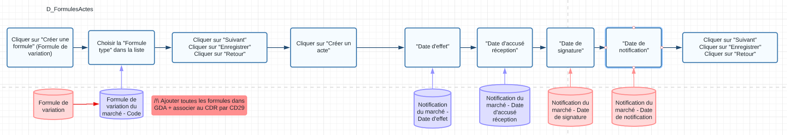

# Reprise des marchés SAFI - D_FormulesActes



## Créer une formule de variation
On clique d'abord sur le bouton "Créer une formule de variation"
```javascript
// Créer une formule
chargerPage('../../intranet/marc/CreerFormuleVariation.gda')
```

Toutes les formules ont été enregistrées dans Excel avec leur index dans le menu déroulant. Il suffit de valoriser le menu déroulant avec l'index du fichier Excel.
```javascript
// Choisir une formule
document.getElementsByName('typeFormuleVariation_miCode')[0].value="%ExcelData[LoopIndex]['Formule de variation du marché - Code']%";
RemplirFormulaire()
```

On lance le javascript du bouton "Suivant".
```javascript
// Suivant
effectuerSuivante()
```

On lance le javascript du bouton "Valider".
```javascript
// Valider
Valider()
```

On lance le javascript du bouton "Retour".
```javascript
// Retour
Retour(00, "../../intranet/marc/AfficheMarche.gda?cas=4&IDG=1&IDG=1&IDIP=IDIP_1670856590548&code=1078&ignorerIDIP=1&onglet=2&histoaction=-1")
```

## Créer un acte

```javascript
// Creer un acte
chargerPage('../../intranet/marc/CreerActe.gda', event);
```

```javascript
// Ajouter dates
document.getElementsByName('acte_mdtEffet')[0].value="%ExcelData[LoopIndex]['Notification du marché - Date d\'effet']%";
document.getElementsByName('acte_mdtSignature')[0].value="%ExcelData[LoopIndex]['Notification du marché - Date de signature']%";
document.getElementsByName('acte_mdtNotification')[0].value="%ExcelData[LoopIndex]['Notification du marché - Date de notification']%";
document.getElementsByName('acte_mdtArrete')[0].value="%ExcelData[LoopIndex]['Notification du marché - Date d\'accusé réception']%";
```

On lance le javascript du bouton "Suivant".
```javascript
// Page suivante
effectuerSuivante()
```
On lance le javascript du bouton "Valider".
```javascript
Valider()
```
On lance le javascript du bouton "Retour".
```javascript
Retour(00, "../../intranet/marc/ChargerRechercheMarche.gda?favCode=145&IDG=1&ignorerIDIP=1&ignorerIDIP=1&onglet=2&histoaction=-1")
```


```javascript
h_jsp_BoutonRetour();
```

On lance le javascript du bouton "Retour".
```javascript
rch_jsp_BoutonRetour();
```


