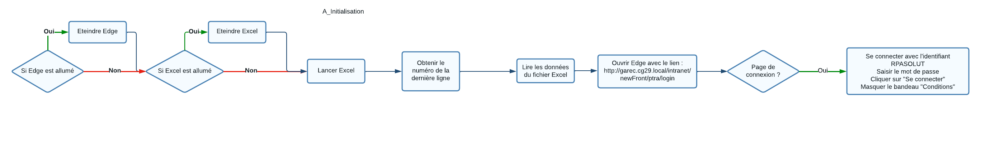
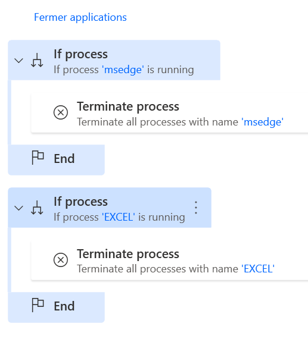
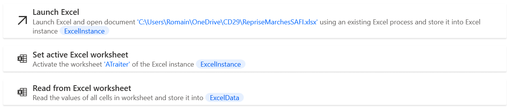
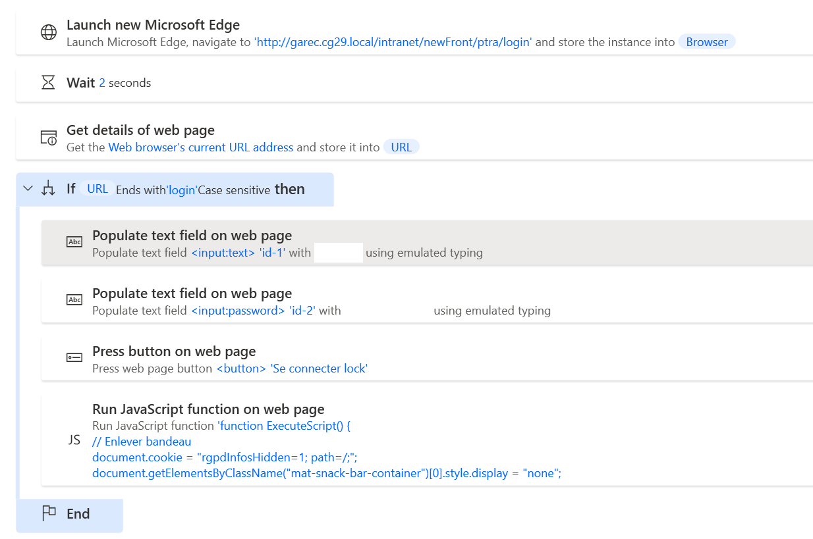

# Reprise des marchés SAFI - E_RapportExecution

## Gestion des données

Un fichier Excel Online pour favoriser un travail collaboratif entre la DFP et la RPA.

Les modifications sont traitées en temps réel avec les données à jour pour permettre à la DFP de mettre à jour les valeurs et que la RPA puisse continuer les tests au fur et à mesure.

Le fichier Excel comporte environ 200 colonnes. Elles sont détaillées en [Annexe](#donnees-excel-projet-reprise-des-marches-safi)

[Lien vers le fichier Excel](https://1drv.ms/x/s!AmiJK4RIVLBXgSBT9GcikC_QRGv6?e=z07vII)

## Vision globale du projet

Un diagramme LucidChart est attaché au projet et permet de visualiser les différentes étapes.

Il permet de confirmer les étapes à paramétrer pour le robot en envisageant tous les cas possibles à traiter.

[Lien vers le diagramme LucidChart](https://lucid.app/lucidchart/481ce2c2-3b15-4080-a4a7-5e4b729edab0/edit?viewport_loc=-3659%2C-1579%2C45266%2C27069%2C0_0&invitationId=inv_0482e918-03d2-4dc7-ac95-2fddd838edbc)

## Main


L'automatisation démarre par une  :
  - Fermer les applications ouvertes
  - Lire les données dans le fichier Excel
  - Se connecter à Grand Angle


Ensuite on démarre une boucle qui se répétera à chaque ligne du fichier Excel
Tous les contractants sont sur la même ligne (jusqu'à 10 contractants, d'où le nombre important de colonnes)

On continue avec l'étape de 


## A_Initialisation

### A_Initialisation - Fermer les applications


### A_Initialisation - Lire les données dans le fichier Excel

Les données sont stockées dans ExcelData.
Pour y accéder, il faut ajouter des crochets : ExcelData[x][y]
Où "x" correspond à la ligne et "y" correspond à la colonne.

Le tableau comporte une ligne d'en-tête, donc la première ligne de données est la ligne numéro 2 sur Excel. Dans ExcelData, elle correspond à x=0.
x correspond donc au numéro de la ligne Excel moins 2.

Pour y, plutôt que de raisonner par lettres pour les colonnes. On peut utiliser directement le titre de la colonne entre apostrophes. Les colonnes peuvent ainsi être déplacées sans problèmes.

!!! Warning
    Penser à bien mettre à jour la colonne de fin lorsque de nouvelles colonnes sont ajoutées à l'étape de lecture des données du fichier Excel.


### A_Initialisation - Se connecter à Grand Angle

On allume Microsoft Edge sur la page de connexion.

Il peut arriver (surtout lors des tests) que l'on soit déjà connectés afin de poursuivre l'automatisation même dans un statut connecté, on vérifie l'URL.
Si on est sur la page de connexion, l'URL de la page se termine par "login" on remplit alors les informations de connexion.
Si on est redirigé automatiquement sur le tableau de bord, l'URL change et ne se termine plus par "login". Les étapes sont ignorées.

Lors de la connexion, un bandeau s'affiche pour accepter les cookies. Pour le masquer, on ajoute ce script :

``` javascript
// Enlever bandeau
document.cookie = "rgpdInfosHidden=1; path=/;";
document.getElementsByClassName("mat-snack-bar-container")[0].style.display = "none";
```


## B_CreationNouveauMarche


### Cliquer sur créer un nouveau marché et remplir les premières informations

#### Cliquer sur les éléments du menu

```javascript
//Cliquer sur les elements du menu
document.getElementsByClassName("bouton-menu")[0].click()
document.getElementsByClassName("mat-focus-indicator bandeau__button mat-button mat-button-base ng-star-inserted")[3].click()
document.getElementsByClassName('menu ng-star-inserted')[0].click()
document.getElementsByClassName('gda_bouton NouveauImg gda_bouton_actif')[0].click()
```

#### Remplir la première page
```javascript
//Remplir les informations sur le marché
document.getElementsByName('marche_miAnnee')[0].value="%ExcelData[LoopIndex]['Numéro de marché - Année AAAA']%";
document.getElementsByName('marche_msNumero')[0].value="%ExcelData[LoopIndex]['Numéro de marché - Code']%";
document.getElementsByName('marche_msObjet')[0].value="%ExcelData[LoopIndex]['Objet']%";
```
#### Cliquer sur Suivant

On lance le javascript associé au bouton Suivant.

```javascript
effectuerSuivante()
```
#### Remplir la durée
```javascript
// Duree
document.getElementsByName('marcheDuree_miAnnees')[0].value="%ExcelData[LoopIndex]['Durée du marché - Années']%";
document.getElementsByName('marcheDuree_miMois')[0].value="%ExcelData[LoopIndex]['Durée du marché - Mois']%";
document.getElementsByName('marcheDuree_miJours')[0].value="%ExcelData[LoopIndex]['Durée du marché - Jours']%";
```

### Ajouter un type d'engagement

#### Cliquer sur la loupe Type d'engagement

Plutôt que de cliquer sur la loupe directement, on lance le javascript associé.

```javascript
// Cliquer sur la loupe Type d'engagement
saisieAssisteeTypeEnga()
```

#### Attacher la nouvelle fenêtre de navigateur


#### Remplir la code à rechercher

```javascript
document.getElementsByName('typejCode')[0].value="%ExcelData[LoopIndex]['Type d\'engagement - Code']%";
```

#### Cliquer sur le bouton Rechercher

On lance le script associé au bouton Rechercher
```javascript
rch_jsp_BoutonRechercher()
```

#### CLiquer sur le premier élément de la liste
Ici, il n'y a pas de Name ou d'ID pour choisir l'élément à cliquer. On fait donc une recherche par TagName. Il s'agit du 5ème élément de la liste des "a" sur la page.
```javascript
document.getElementsByTagName('a')[4].click()
```
!!! note
    Pour déduire la recherche par TagName à utiliser. Dans l'inspecteur il faut regarder le type d'élément. Ici il s'agit d'un lien "a". On recherche ensuite par itération avec la console jusqu'à ce que notre élément soit sélectionné:
    ```javascript
      document.getElementsByTagName('a')[0]
      document.getElementsByTagName('a')[1]
      document.getElementsByTagName('a')[2]
      document.getElementsByTagName('a')[3]
      document.getElementsByTagName('a')[4]
    ```

### Remplir la forme et le type de prix
#### Forme de prix
Il s'agit d'un menu déroulant, mais on peut valoriser la valeur comme un champ de texte.
```javascript
// Forme de prix
document.getElementsByName('formePrix_miCode')[0].value="%ExcelData[LoopIndex]['Forme de prix - Code']%";
```

!!! note
    Pour simplifier l'automatisation, tous les choix possibles sont rassemblés dans la feuille "Listes" sur Excel avec la correspondance avec le code sur Grand Angle.
    Une colonne a ensuite été ajoutée sur la feuille principale en utilisant RECHERCHEV() qui affiche directement le code qui correspond à l'option à sélectionner.

#### Type de prix

Il s'agit d'un bouton radio, mais on peut valoriser la valeur comme un champ de texte.
```javascript
// Type de prix
document.getElementsByName('typePrix_miCode')[0].value="%ExcelData[LoopIndex]['Type de prix - Code']%";
```

Après avoir sélectionné le type de prix, de nouvelles cases s'affichent.


## Annexes

### Données Excel projet Reprise des marchés SAFI

| Titre                                               | Description                                                                                                                                                                                                                           |
| --------------------------------------------------- | ------------------------------------------------------------------------------------------------------------------------------------------------------------------------------------------------------------------------------------- |
| Date                                                | Date de dernier traitement                                                                                                                                                                                                            |
| Heure                                               | Heure de dernier traitement                                                                                                                                                                                                           |
| Base                                                | Base (Garec pour démarrer)                                                                                                                                                                                                            |
| Statut                                              | A tester<br>Testé<br>A mettre en prod<br>Réalisé                                                                                                                                                                                      |
| Commentaire RPA                                     | Commentaire sur le statut de l'automatisation<br>Erreurs rencontrées                                                                                                                                                                  |
| Commentaire CD29                                    | Commentaire sur les données<br>Indiquer les lignes à ignorer                                                                                                                                                                          |
| Validation RPA                                      | Noter "Valide" lorsque la ligne a été testée sur la base Garec                                                                                                                                                                        |
| Validation CD29                                     | Noter "Valide"lorsque les informations ont été relues et validées pour cette ligne                                                                                                                                                    |
| Numéro de marché (brut)                             | Numéro de marché                                                                                                                                                                                                                      |
| Numéro de marché - Année AAAA                       | Concaténer "20" et les deux premiers caractères du numéro de marché brut                                                                                                                                                              |
| Numéro de marché - Code                             | Les 5 derniers caractères du numéro de marché brut                                                                                                                                                                                    |
| Objet                                               | Pré-rempli avec "Objet - Opération" à vérifier ou compléter                                                                                                                                                                           |
| Durée du marché (brut)                              | Durée du marché                                                                                                                                                                                                                       |
| Durée du marché - Années                            | Division euclidienne du nombre de mois par 12                                                                                                                                                                                         |
| Durée du marché - Mois                              | Reste de la division euclidienne du nombre de mois par 12                                                                                                                                                                             |
| Durée du marché - Jours                             | Toujours égal à zéro                                                                                                                                                                                                                  |
| Type d'engagement - Code                            | Nombre entier                                                                                                                                                                                                                         |
| Forme de prix                                       | Forme de prix                                                                                                                                                                                                                         |
| Forme de prix - Code                                | Mixte 3<br>Unitaire 2<br>Forfaitaire 1                                                                                                                                                                                                |
| Type de prix                                        | Type de prix                                                                                                                                                                                                                          |
| Type de prix - Code                                 | Fermes 1<br>Fermes actualisables 2<br>Révisable 4                                                                                                                                                                                     |
| Type de prix - Index                                | sur le dernier index connu<br>sur index définitif avec révision provisoire<br>sur index définitif sans révision provisoire                                                                                                            |
| Type de prix - Index - Code                         | sur le dernier index connu indexIC<br>sur index définitif avec révision provisoire indexID<br>sur index définitif sans révision provisoire indexSP                                                                                    |
| Périodicité de révision                             | Mensuelle<br>Annuelle<br>Trimestrielle<br>Semestrielle                                                                                                                                                                                |
| Périodicité de révision - Code                      | Mensuelle 0<br>Annuelle 1<br>Semestrielle 2<br>Trimestrielle 3                                                                                                                                                                        |
| Type de prix - Décalage de lecture - Nombre de mois | Nombre entier de 1 à 12                                                                                                                                                                                                               |
| Date d'actualisation des prix                       | Date                                                                                                                                                                                                                                  |
| Date d'établissement des prix                       | Mois M0 (date d'établissement des prix)                                                                                                                                                                                               |
| Code CPV principal                                  | Pré-rempli avec "Code CPV principal" à vérifier ou compléter                                                                                                                                                                          |
| Montant initial HT                                  | Montant intial HT                                                                                                                                                                                                                     |
| Taux de TVA                                         | Pré-rempli avec "Taux de TVA" à vérifier ou compléter :<br>Multi-taux<br>0%<br>2,1%<br>5,5%<br>10%<br>20%                                                                                                                             |
| Taux de TVA - Code                                  | Multi-taux -1<br>0% 4<br>2,1% 3<br>5,5% 2<br>10% 11<br>20% 10                                                                                                                                                                         |
| Montant initial TTC                                 | Montant TTC                                                                                                                                                                                                                           |
| Mode de passation                                   | Mode de passation                                                                                                                                                                                                                     |
| Mode de passation - Code                            | Appel d'offres ouvert 2<br>Appel d'offres restreint 3<br>Autre 10<br>Concours 8<br>Dialogue compétitif 7<br>Marché négocié 6<br>Procédure adaptée 1<br>Procédure concurrentielle 4<br>Procédure négociée 5<br>Système d'acquisition 9 |
| Dévolution                                          | Titulaire unique<br>Groupement conjoint<br>Groupement solidaire<br>Titulaires et groupements                                                                                                                                          |
| Dévolution - Code                                   | Titulaire unique 1<br>Groupement conjoint 2<br>Groupement solidaire 3<br>Titulaires et groupements 4                                                                                                                                  |
| Gestion de la retenue de garantie                   | Gestion de la retenue de garantie                                                                                                                                                                                                     |
| Gestion de la retenue de garantie - Code            | Pas de retenue de garantie 0<br>Par le payeur sans liquidation détaillée 2<br>Par le payeur avec liquidation détaillée 3                                                                                                              |
| Auto-liquidation de la sous-traitance               | Oui<br>Non                                                                                                                                                                                                                            |
| Reconduction                                        | Pas de reconduction<br>Expresse<br>Tacite                                                                                                                                                                                             |
| Reconduction - Code                                 | Pas de reconduction Pas de reconduction<br>Expresse marche\_mbReconduction<br>Tacite marche\_mbReconductionTacite                                                                                                                     |
| Durée de reconduction - Années                      | Nombre entier                                                                                                                                                                                                                         |
| Durée de reconduction - Mois                        | Nombre entier                                                                                                                                                                                                                         |
| Durée de reconduction - Jours                       | Nombre entier                                                                                                                                                                                                                         |
| Nombre de reconductions                             | Nombre entier                                                                                                                                                                                                                         |
| Date de consultation                                | Date de consultation                                                                                                                                                                                                                  |
| Date de signature                                   | Date de signature                                                                                                                                                                                                                     |
| Formule de variation du marché (brut)               | Formule de variation du marché                                                                                                                                                                                                        |
| Formule de variation du marché                      | Nombre entier                                                                                                                                                                                                                         |
| Formule de variation du marché - Code               | A faire lorsque les formules seront dans Grand Angle                                                                                                                                                                                  |
| Notification du marché - Date d'effet               | Notification du marché - Date d'AR                                                                                                                                                                                                    |
| Notification du marché - Date de signature          | Date de signature                                                                                                                                                                                                                     |
| Notification du marché - Date de notification       | Notification du marché - Date                                                                                                                                                                                                         |
| Notification du marché - Date d'accusé réception    | Notification du marché - Date d'AR                                                                                                                                                                                                    |
| Nombre de contractants                              | Si le contractant N+1 est vide : N<br>Sinon N+1                                                                                                                                                                                       |
| Contractant 1 (brut)                                | Contractant                                                                                                                                                                                                                           |
| Contractant 1 - Tiers - Code                        | Nombre entier                                                                                                                                                                                                                         |
| Contractant 1 - Rôle                                | Titulaire<br>Sous-traitant<br>Mandataire                                                                                                                                                                                              |
| Contractant 1 - Rôle - Code                         | A définir                                                                                                                                                                                                                             |
| Contractant 1 - Mandataire - Désignation            | A remplir si le rôle du contractant est "Mandataire"                                                                                                                                                                                  |
| Contractant 1 - Iban à créditer                     | Contractant - Iban à créditer                                                                                                                                                                                                         |
| Contractant 1 - Montant prévisionnel HT             | Nombre 2 décimales                                                                                                                                                                                                                    |
| Contractant 1 - Montant HT                          | Nombre 2 décimales                                                                                                                                                                                                                    |
| Contractant 1 - TVA                                 | Multi-taux<br>0%<br>2,1%<br>5,5%<br>10%<br>20%                                                                                                                                                                                        |
| Contractant 1 - TVA - Code                          | Multi-taux (Vide)<br>0% 4<br>2,1% 3<br>5,5% 2<br>10% 11<br>20% 10                                                                                                                                                                     |
| Contractant 1 - Montant TTC                         | Nombre 2 décimales                                                                                                                                                                                                                    |
| Contractant 1 - Avance                              | Aucune<br>Obligatoire<br>Facultative<br>A chaque bon de commande<br>Refusée                                                                                                                                                           |
| Contractant 1 - Avance - Code                       | Aucune 1<br>Obligatoire 2<br>Facultative 3<br>A chaque bon de commande 4<br>Refusée 5                                                                                                                                                 |
| Contractant 1 - Taux d'avance                       | Nombre 2 décimales                                                                                                                                                                                                                    |
| Contractant 2 (brut)                                | Contractant                                                                                                                                                                                                                           |
| Contractant 2 - Tiers - Code                        | Nombre entier                                                                                                                                                                                                                         |
| Contractant 2 - Rôle                                | Titulaire<br>Sous-traitant<br>Mandataire                                                                                                                                                                                              |
| Contractant 2 - Rôle - Code                         | A définir                                                                                                                                                                                                                             |
| Contractant 2 - Mandataire - Désignation            | A remplir si le rôle du contractant est "Mandataire"                                                                                                                                                                                  |
| Contractant 2 - Iban à créditer                     | Contractant - Iban à créditer                                                                                                                                                                                                         |
| Contractant 2 - Montant prévisionnel HT             | Nombre 2 décimales                                                                                                                                                                                                                    |
| Contractant 2 - Montant HT                          | Nombre 2 décimales                                                                                                                                                                                                                    |
| Contractant 2 - TVA                                 | Multi-taux<br>0%<br>2,1%<br>5,5%<br>10%<br>20%                                                                                                                                                                                        |
| Contractant 2 - TVA - Code                          | Multi-taux (Vide)<br>0% 4<br>2,1% 3<br>5,5% 2<br>10% 11<br>20% 10                                                                                                                                                                     |
| Contractant 2 - Montant TTC                         | Nombre 2 décimales                                                                                                                                                                                                                    |
| Contractant 2 - Avance                              | Aucune<br>Obligatoire<br>Facultative<br>A chaque bon de commande<br>Refusée                                                                                                                                                           |
| Contractant 2 - Avance - Code                       | Aucune 1<br>Obligatoire 2<br>Facultative 3<br>A chaque bon de commande 4<br>Refusée 5                                                                                                                                                 |
| Contractant 2 - Taux d'avance                       | Nombre 2 décimales                                                                                                                                                                                                                    |
| Contractant 3 (brut)                                | Contractant                                                                                                                                                                                                                           |
| Contractant 3 - Tiers - Code                        | Nombre entier                                                                                                                                                                                                                         |
| Contractant 3 - Rôle                                | Titulaire<br>Sous-traitant<br>Mandataire                                                                                                                                                                                              |
| Contractant 3 - Rôle - Code                         | A définir                                                                                                                                                                                                                             |
| Contractant 3 - Mandataire - Désignation            | A remplir si le rôle du contractant est "Mandataire"                                                                                                                                                                                  |
| Contractant 3 - Iban à créditer                     | Contractant - Iban à créditer                                                                                                                                                                                                         |
| Contractant 3 - Montant prévisionnel HT             | Nombre 2 décimales                                                                                                                                                                                                                    |
| Contractant 3 - Montant HT                          | Nombre 2 décimales                                                                                                                                                                                                                    |
| Contractant 3 - TVA                                 | Multi-taux<br>0%<br>2,1%<br>5,5%<br>10%<br>20%                                                                                                                                                                                        |
| Contractant 3 - TVA - Code                          | Multi-taux (Vide)<br>0% 4<br>2,1% 3<br>5,5% 2<br>10% 11<br>20% 10                                                                                                                                                                     |
| Contractant 3 - Montant TTC                         | Nombre 2 décimales                                                                                                                                                                                                                    |
| Contractant 3 - Avance                              | Aucune<br>Obligatoire<br>Facultative<br>A chaque bon de commande<br>Refusée                                                                                                                                                           |
| Contractant 3 - Avance - Code                       | Aucune 1<br>Obligatoire 2<br>Facultative 3<br>A chaque bon de commande 4<br>Refusée 5                                                                                                                                                 |
| Contractant 3 - Taux d'avance                       | Nombre 2 décimales                                                                                                                                                                                                                    |
| Contractant 4 (brut)                                | Contractant                                                                                                                                                                                                                           |
| Contractant 4 - Tiers - Code                        | Nombre entier                                                                                                                                                                                                                         |
| Contractant 4 - Rôle                                | Titulaire<br>Sous-traitant<br>Mandataire                                                                                                                                                                                              |
| Contractant 4 - Rôle - Code                         | A définir                                                                                                                                                                                                                             |
| Contractant 4 - Mandataire - Désignation            | A remplir si le rôle du contractant est "Mandataire"                                                                                                                                                                                  |
| Contractant 4 - Iban à créditer                     | Contractant - Iban à créditer                                                                                                                                                                                                         |
| Contractant 4 - Montant prévisionnel HT             | Nombre 2 décimales                                                                                                                                                                                                                    |
| Contractant 4 - Montant HT                          | Nombre 2 décimales                                                                                                                                                                                                                    |
| Contractant 4 - TVA                                 | Multi-taux<br>0%<br>2,1%<br>5,5%<br>10%<br>20%                                                                                                                                                                                        |
| Contractant 4 - TVA - Code                          | Multi-taux (Vide)<br>0% 4<br>2,1% 3<br>5,5% 2<br>10% 11<br>20% 10                                                                                                                                                                     |
| Contractant 4 - Montant TTC                         | Nombre 2 décimales                                                                                                                                                                                                                    |
| Contractant 4 - Avance                              | Aucune<br>Obligatoire<br>Facultative<br>A chaque bon de commande<br>Refusée                                                                                                                                                           |
| Contractant 4 - Avance - Code                       | Aucune 1<br>Obligatoire 2<br>Facultative 3<br>A chaque bon de commande 4<br>Refusée 5                                                                                                                                                 |
| Contractant 4 - Taux d'avance                       | Nombre 2 décimales                                                                                                                                                                                                                    |
| Contractant 5 (brut)                                | Contractant                                                                                                                                                                                                                           |
| Contractant 5 - Tiers - Code                        | Nombre entier                                                                                                                                                                                                                         |
| Contractant 5 - Rôle                                | Titulaire<br>Sous-traitant<br>Mandataire                                                                                                                                                                                              |
| Contractant 5 - Rôle - Code                         | A définir                                                                                                                                                                                                                             |
| Contractant 5 - Mandataire - Désignation            | A remplir si le rôle du contractant est "Mandataire"                                                                                                                                                                                  |
| Contractant 5 - Iban à créditer                     | Contractant - Iban à créditer                                                                                                                                                                                                         |
| Contractant 5 - Montant prévisionnel HT             | Nombre 2 décimales                                                                                                                                                                                                                    |
| Contractant 5 - Montant HT                          | Nombre 2 décimales                                                                                                                                                                                                                    |
| Contractant 5 - TVA                                 | Multi-taux<br>0%<br>2,1%<br>5,5%<br>10%<br>20%                                                                                                                                                                                        |
| Contractant 5 - TVA - Code                          | Multi-taux (Vide)<br>0% 4<br>2,1% 3<br>5,5% 2<br>10% 11<br>20% 10                                                                                                                                                                     |
| Contractant 5 - Montant TTC                         | Nombre 2 décimales                                                                                                                                                                                                                    |
| Contractant 5 - Avance                              | Aucune<br>Obligatoire<br>Facultative<br>A chaque bon de commande<br>Refusée                                                                                                                                                           |
| Contractant 5 - Avance - Code                       | Aucune 1<br>Obligatoire 2<br>Facultative 3<br>A chaque bon de commande 4<br>Refusée 5                                                                                                                                                 |
| Contractant 5 - Taux d'avance                       | Nombre 2 décimales                                                                                                                                                                                                                    |
| Contractant 6 (brut)                                | Contractant                                                                                                                                                                                                                           |
| Contractant 6 - Tiers - Code                        | Nombre entier                                                                                                                                                                                                                         |
| Contractant 6 - Rôle                                | Titulaire<br>Sous-traitant<br>Mandataire                                                                                                                                                                                              |
| Contractant 6 - Rôle - Code                         | A définir                                                                                                                                                                                                                             |
| Contractant 6 - Mandataire - Désignation            | A remplir si le rôle du contractant est "Mandataire"                                                                                                                                                                                  |
| Contractant 6 - Iban à créditer                     | Contractant - Iban à créditer                                                                                                                                                                                                         |
| Contractant 6 - Montant prévisionnel HT             | Nombre 2 décimales                                                                                                                                                                                                                    |
| Contractant 6 - Montant HT                          | Nombre 2 décimales                                                                                                                                                                                                                    |
| Contractant 6 - TVA                                 | Multi-taux<br>0%<br>2,1%<br>5,5%<br>10%<br>20%                                                                                                                                                                                        |
| Contractant 6 - TVA - Code                          | Multi-taux (Vide)<br>0% 4<br>2,1% 3<br>5,5% 2<br>10% 11<br>20% 10                                                                                                                                                                     |
| Contractant 6 - Montant TTC                         | Nombre 2 décimales                                                                                                                                                                                                                    |
| Contractant 6 - Avance                              | Aucune<br>Obligatoire<br>Facultative<br>A chaque bon de commande<br>Refusée                                                                                                                                                           |
| Contractant 6 - Avance - Code                       | Aucune 1<br>Obligatoire 2<br>Facultative 3<br>A chaque bon de commande 4<br>Refusée 5                                                                                                                                                 |
| Contractant 6 - Taux d'avance                       | Nombre 2 décimales                                                                                                                                                                                                                    |
| Contractant 7 (brut)                                | Contractant                                                                                                                                                                                                                           |
| Contractant 7 - Tiers - Code                        | Nombre entier                                                                                                                                                                                                                         |
| Contractant 7 - Rôle                                | Titulaire<br>Sous-traitant<br>Mandataire                                                                                                                                                                                              |
| Contractant 7 - Rôle - Code                         | A définir                                                                                                                                                                                                                             |
| Contractant 7 - Mandataire - Désignation            | A remplir si le rôle du contractant est "Mandataire"                                                                                                                                                                                  |
| Contractant 7 - Iban à créditer                     | Contractant - Iban à créditer                                                                                                                                                                                                         |
| Contractant 7 - Montant prévisionnel HT             | Nombre 2 décimales                                                                                                                                                                                                                    |
| Contractant 7 - Montant HT                          | Nombre 2 décimales                                                                                                                                                                                                                    |
| Contractant 7 - TVA                                 | Multi-taux<br>0%<br>2,1%<br>5,5%<br>10%<br>20%                                                                                                                                                                                        |
| Contractant 7 - TVA - Code                          | Multi-taux (Vide)<br>0% 4<br>2,1% 3<br>5,5% 2<br>10% 11<br>20% 10                                                                                                                                                                     |
| Contractant 7 - Montant TTC                         | Nombre 2 décimales                                                                                                                                                                                                                    |
| Contractant 7 - Avance                              | Aucune<br>Obligatoire<br>Facultative<br>A chaque bon de commande<br>Refusée                                                                                                                                                           |
| Contractant 7 - Avance - Code                       | Aucune 1<br>Obligatoire 2<br>Facultative 3<br>A chaque bon de commande 4<br>Refusée 5                                                                                                                                                 |
| Contractant 7 - Taux d'avance                       | Nombre 2 décimales                                                                                                                                                                                                                    |
| Contractant 8 (brut)                                | Contractant                                                                                                                                                                                                                           |
| Contractant 8 - Tiers - Code                        | Nombre entier                                                                                                                                                                                                                         |
| Contractant 8 - Rôle                                | Titulaire<br>Sous-traitant<br>Mandataire                                                                                                                                                                                              |
| Contractant 8 - Rôle - Code                         | A définir                                                                                                                                                                                                                             |
| Contractant 8 - Mandataire - Désignation            | A remplir si le rôle du contractant est "Mandataire"                                                                                                                                                                                  |
| Contractant 8 - Iban à créditer                     | Contractant - Iban à créditer                                                                                                                                                                                                         |
| Contractant 8 - Montant prévisionnel HT             | Nombre 2 décimales                                                                                                                                                                                                                    |
| Contractant 8 - Montant HT                          | Nombre 2 décimales                                                                                                                                                                                                                    |
| Contractant 8 - TVA                                 | Multi-taux<br>0%<br>2,1%<br>5,5%<br>10%<br>20%                                                                                                                                                                                        |
| Contractant 8 - TVA - Code                          | Multi-taux (Vide)<br>0% 4<br>2,1% 3<br>5,5% 2<br>10% 11<br>20% 10                                                                                                                                                                     |
| Contractant 8 - Montant TTC                         | Nombre 2 décimales                                                                                                                                                                                                                    |
| Contractant 8 - Avance                              | Aucune<br>Obligatoire<br>Facultative<br>A chaque bon de commande<br>Refusée                                                                                                                                                           |
| Contractant 8 - Avance - Code                       | Aucune 1<br>Obligatoire 2<br>Facultative 3<br>A chaque bon de commande 4<br>Refusée 5                                                                                                                                                 |
| Contractant 8 - Taux d'avance                       | Nombre 2 décimales                                                                                                                                                                                                                    |
| Contractant 9 (brut)                                | Contractant                                                                                                                                                                                                                           |
| Contractant 9 - Tiers - Code                        | Nombre entier                                                                                                                                                                                                                         |
| Contractant 9 - Rôle                                | Titulaire<br>Sous-traitant<br>Mandataire                                                                                                                                                                                              |
| Contractant 9 - Rôle - Code                         | A définir                                                                                                                                                                                                                             |
| Contractant 9 - Mandataire - Désignation            | A remplir si le rôle du contractant est "Mandataire"                                                                                                                                                                                  |
| Contractant 9 - Iban à créditer                     | Contractant - Iban à créditer                                                                                                                                                                                                         |
| Contractant 9 - Montant prévisionnel HT             | Nombre 2 décimales                                                                                                                                                                                                                    |
| Contractant 9 - Montant HT                          | Nombre 2 décimales                                                                                                                                                                                                                    |
| Contractant 9 - TVA                                 | Multi-taux<br>0%<br>2,1%<br>5,5%<br>10%<br>20%                                                                                                                                                                                        |
| Contractant 9 - TVA - Code                          | Multi-taux (Vide)<br>0% 4<br>2,1% 3<br>5,5% 2<br>10% 11<br>20% 10                                                                                                                                                                     |
| Contractant 9 - Montant TTC                         | Nombre 2 décimales                                                                                                                                                                                                                    |
| Contractant 9 - Avance                              | Aucune<br>Obligatoire<br>Facultative<br>A chaque bon de commande<br>Refusée                                                                                                                                                           |
| Contractant 9 - Avance - Code                       | Aucune 1<br>Obligatoire 2<br>Facultative 3<br>A chaque bon de commande 4<br>Refusée 5                                                                                                                                                 |
| Contractant 9 - Taux d'avance                       | Nombre 2 décimales                                                                                                                                                                                                                    |
| Contractant 10 (brut)                               | Contractant                                                                                                                                                                                                                           |
| Contractant 10 - Tiers - Code                       | Nombre entier                                                                                                                                                                                                                         |
| Contractant 10 - Rôle                               | Titulaire<br>Sous-traitant<br>Mandataire                                                                                                                                                                                              |
| Contractant 10 - Rôle - Code                        | A définir                                                                                                                                                                                                                             |
| Contractant 10 - Mandataire - Désignation           | A remplir si le rôle du contractant est "Mandataire"                                                                                                                                                                                  |
| Contractant 10 - Iban à créditer                    | Contractant - Iban à créditer                                                                                                                                                                                                         |
| Contractant 10 - Montant prévisionnel HT            | Nombre 2 décimales                                                                                                                                                                                                                    |
| Contractant 10 - Montant HT                         | Nombre 2 décimales                                                                                                                                                                                                                    |
| Contractant 10 - TVA                                | Multi-taux<br>0%<br>2,1%<br>5,5%<br>10%<br>20%                                                                                                                                                                                        |
| Contractant 10 - TVA - Code2                        | Multi-taux (Vide)<br>0% 4<br>2,1% 3<br>5,5% 2<br>10% 11<br>20% 10                                                                                                                                                                     |
| Contractant 10 - Montant TTC                        | Nombre 2 décimales                                                                                                                                                                                                                    |
| Contractant 10 - Avance                             | Aucune<br>Obligatoire<br>Facultative<br>A chaque bon de commande<br>Refusée                                                                                                                                                           |
| Contractant 10 - Avance - Code                      | Aucune 1<br>Obligatoire 2<br>Facultative 3<br>A chaque bon de commande 4<br>Refusée 5                                                                                                                                                 |
| Contractant 10 - Taux d'avance                      | Nombre 2 décimales                                                                                                                                                                                                                    |