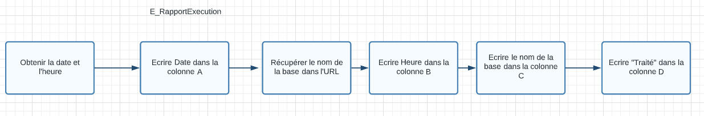
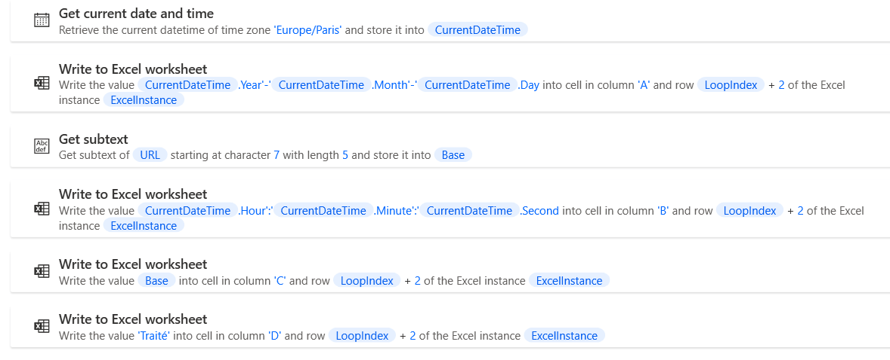

# Reprise des marchés SAFI - E_RapportExecution

## Récupérer informations

- Obtenir la date et l'heure
- Récupérer le nom de la base dans l'URL

## Ecrire informations dans Excel
- Colonne A : Date
- Colonne B : Heure
- Colonne C : Base
- Colonne D : "Traité

On arrive à la fin de la boucle. S'il reste des lignes à traiter, on peut continuer avec le flux B_CreationMarche.

Si on arrive à la dernière ligne, on lance le flux F_Finalisation.