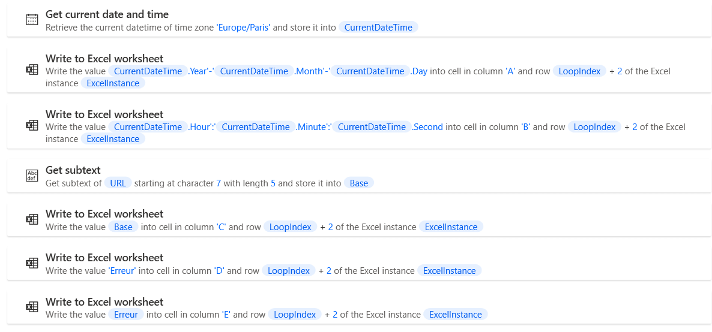

# Reprise des marchés SAFI - G_RapportErreur

## Récupérer informations

- Un message d'erreur est enregistré au préalable dans la variable "Erreur"
- Obtenir la date et l'heure
- Récupérer le nom de la base dans l'URL

## Ecrire informations dans Excel
- Colonne A : Date
- Colonne B : Heure
- Colonne C : Base
- Colonne D : "Erreur"
- Colonne E : Détails de l'erreur