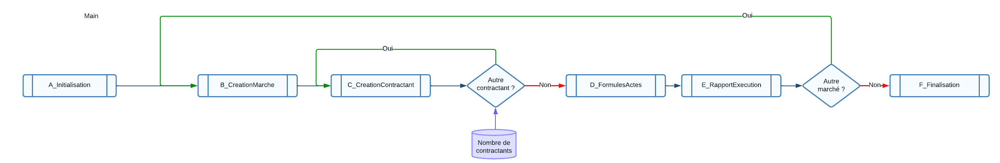

# Reprise des marchés SAFI - Présentation

## Gestion des données

Un fichier Excel Online pour favoriser un travail collaboratif entre la DFP et la RPA.

Les modifications sont traitées en temps réel avec les données à jour pour permettre à la DFP de mettre à jour les valeurs et que la RPA puisse continuer les tests au fur et à mesure.

Le fichier Excel comporte environ 200 colonnes. Elles sont détaillées en [Annexes](/SAFI/annexes)

[Lien vers le fichier Excel](https://1drv.ms/x/s!AmiJK4RIVLBXgSBT9GcikC_QRGv6?e=z07vII)

## Vision globale du projet

Un diagramme LucidChart est attaché au projet et permet de visualiser les différentes étapes.

Il permet de confirmer les étapes à paramétrer pour le robot en envisageant tous les cas possibles à traiter.

[Lien vers le diagramme LucidChart](https://lucid.app/lucidchart/481ce2c2-3b15-4080-a4a7-5e4b729edab0/edit?viewport_loc=-3659%2C-1579%2C45266%2C27069%2C0_0&invitationId=inv_0482e918-03d2-4dc7-ac95-2fddd838edbc)

## Procédure

!!! Warning Format date et nombre sur Excel
    Le format Date sur Excel doit être : JJ/MM/AAAA
    Le séparateur de décimales doit être un point et non pas une virgule.

### A_Initialisation
  - Fermer les applications ouvertes
  - Lire les données dans le fichier Excel
  - Se connecter à Grand Angle

Ensuite on démarre une boucle qui se répétera à chaque ligne du fichier Excel
Tous les contractants sont sur la même ligne (jusqu'à 10 contractants, d'où le nombre important de colonnes)

### B_CreationNouveauMarche

  - Cliquer sur créer un nouveau marché et remplir les premières informations
  - Ajouter un type d'engagement
  - Remplir la forme, le type de prix et leur date d'établissement
  - Choisir le Code CPV
  - Remplir les Montants
  - Remplir Mode de passation, dévolution et la gestion de la retenue de garantie
  - Définir l'auto-liquidation de la sous-traitance
  - Reconduction
  - Définir les dates de consultation, de signature
  - Délai de liquidation et fin du flux

### C_CreationContractant

  - Choisir "Créer un contractant"
  - Identifier le contractant
  - Définir les montants
  - Choisir du mécanisme d'avance

### D_FormulesActes

  - Créer une formule de variation
  - Créer un acte

### E_RapportExecution

  - Récupérer informations
  - Ecrire informations dans Excel

### F_Finalisation

  - Fermer applications en cours

### G_RapportErreur
  - Récupérer informations
  - Ecrire informations dans Excel

## Lancer l'automatisation
Avant de lancer l'automatisation, il faut s'assurer que les données à traiter apparaissent bien dans le fichier "A traiter"

Pour les faire apparaître, il faut modifier la feuille "RPA" pour que la colonne CD29 comporte la valeur : "Achevé" et que la colonne RPA soit vide.

Il faut également que toutes les lignes en dessous du tableau soient vides et sans formatage pour que l'automatisation s'arrête.

Dans le pire des cas, le système retournera une erreur et ne pourra pas créer de nouveau marché. Les marchés précédents seront bien créés et le rapport d'éxecution sera également à jour.

Il suffira de fermer manuellement Excel et Edge.

Après le traitement, les données sont toujours dans la feuille "A traiter".

Pour migrer les lignes vers la feuille "Traité", il suffit de remplir "Valide" dans la feuille "RPA"

Le rapport d'exécution restera dans la feuille "A traiter", il faudra reporter ces informations dans la feuille "Traité" manuellement.
